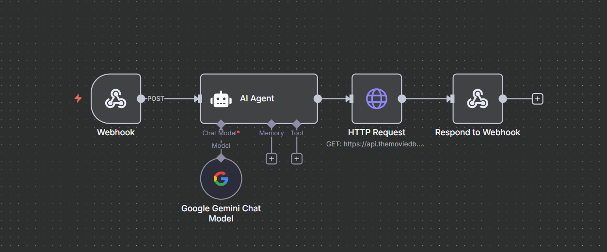

# 🎬 BotFlix

> Seu assistente pessoal para encontrar o filme perfeito baseado no seu humor e preferências

BotFlix é uma aplicação web inteligente que utiliza inteligência artificial para recomendar filmes personalizados. Basta descrever como você está se sentindo ou o que deseja assistir, e o sistema encontrará o filme ideal para você através da integração com a API do TMDB (The Movie Database).


---

## 🚀 Tecnologias Utilizadas

- **HTML5** - Estrutura semântica da aplicação
- **CSS3** - Estilização moderna com animações e gradientes
- **JavaScript (Vanilla)** - Lógica de interação e requisições assíncronas
- **N8N Webhook** - Integração com workflow de automação
- **TMDB API** - Base de dados de filmes e metadados
- **Ngrok** - Túnel para desenvolvimento local (webhook)

---

## 🧠 Funcionalidades

- ✅ **Recomendação Inteligente**: Descreva seu humor ou preferência e receba sugestões personalizadas
- ✅ **Interface Moderna**: Design inspirado na Netflix com animações suaves
- ✅ **Busca por Sentimento**: Aceita descrições naturais como "quero algo engraçado" ou "preciso de um thriller"
- ✅ **Informações Completas**: Exibe poster, título, sinopse e avaliação do filme
- ✅ **Experiência Responsiva**: Layout adaptável para diferentes dispositivos
- ✅ **Animações Fluidas**: Efeitos visuais que tornam a experiência mais imersiva

---

## 🗂️ Estrutura do Projeto

```
botflix/
├── src/
│   ├── css/
│   │   ├── reset.css          # Reset de estilos padrão
│   │   └── styles.css         # Estilos principais e animações
│   ├── js/
│   │   ├── config.js          # Configuração do webhook (não versionado)
│   │   ├── config.example.js  # Exemplo de configuração
│   │   └── index.js           # Lógica principal da aplicação
│   └── images/
│       └── botflix-robot.jpg  # Logo do assistente
├── index.html                 # Página principal
├── LICENSE                    # Licença MIT
└── .gitignore                # Arquivos ignorados pelo Git
```

---

## ⚙️ Como Executar o Projeto

### Pré-requisitos

- Navegador web moderno (Chrome, Firefox, Edge, Safari)
- Servidor local (Live Server, http-server, ou similar)
- N8N configurado com workflow para processamento de filmes
- Conta na [TMDB API](https://www.themoviedb.org/settings/api)

### Passo a passo

1️⃣ **Clone o repositório**
```bash
git clone https://github.com/alanborgesdev/botflix.git
cd botflix
```

2️⃣ **Configure o webhook**
```bash
# Copie o arquivo de exemplo
cp src/js/config.example.js src/js/config.js

# Edite o arquivo config.js e adicione sua URL do webhook N8N
```

No arquivo `src/js/config.js`:
```javascript
const config = {
    webHookUrl: 'SUA_URL_N8N_WEBHOOK_AQUI'
};
```

3️⃣ **Execute com um servidor local**

**Opção 1 - Live Server (VSCode)**
- Instale a extensão "Live Server"
- Clique com botão direito em `index.html`
- Selecione "Open with Live Server"

**Opção 2 - Python**
```bash
# Python 3
python -m http.server 8000

# Python 2
python -m SimpleHTTPServer 8000
```

**Opção 3 - Node.js (http-server)**
```bash
npx http-server -p 8000
```

4️⃣ **Acesse a aplicação**
```
http://localhost:8000
```

---

## 🔧 Configuração do N8N Workflow

### Arquitetura do Workflow



*Workflow N8N: Webhook → AI Agent (Google Gemini) → HTTP Request (TMDB API) → Respond to Webhook*

Para que o BotFlix funcione corretamente, você precisa configurar um workflow no N8N que:

1. **Webhook**: Receba o prompt do usuário via POST
2. **AI Agent (Google Gemini)**: Processe a intenção e identifique o tipo de filme desejado
3. **HTTP Request**: Consulte a TMDB API para buscar filmes correspondentes
4. **Respond to Webhook**: Retorne os resultados no formato esperado

```json
{
  "results": [
    {
      "title": "Nome do Filme",
      "overview": "Sinopse do filme",
      "poster_path": "/caminho-do-poster.jpg",
      "vote_average": 8.5
    }
  ]
}
```

---

## 🎨 Características de Design

- **Paleta de Cores**: Inspirada na Netflix (preto, vermelho #E50914)
- **Tipografia**: Inter (Google Fonts) para legibilidade moderna
- **Animações CSS**: Gradientes animados em background e flutuação do robô
- **Glassmorphism**: Cards com efeito de vidro fosco
- **Hover Effects**: Transformações suaves nos cards de filmes
- **Responsividade**: Layout flexível que se adapta a diferentes telas

---

## 🧪 Exemplos de Uso

Digite no campo de busca:

- *"Quero algo engraçado para relaxar depois do trabalho"*
- *"Estou procurando um thriller que me deixe na ponta da cadeira"*
- *"Algo romântico para assistir com minha namorada"*
- *"Preciso de um filme de ação com muita adrenalina"*
- *"Quero chorar com um drama emocionante"*

---

## 📸 Demonstração

### Interface Principal


### Resultado da Busca


---

## 🤝 Contribuindo

Contribuições são bem-vindas! Para contribuir:

1. Faça um fork do projeto
2. Crie uma branch para sua feature (`git checkout -b feature/NovaFuncionalidade`)
3. Commit suas mudanças (`git commit -m 'Adiciona nova funcionalidade'`)
4. Push para a branch (`git push origin feature/NovaFuncionalidade`)
5. Abra um Pull Request

---

## 📬 Contato

**Alan Borges**

- GitHub: [@alanborgesdev](https://github.com/alanborgesdev)
- LinkedIn: [linkedin.com/in/alanborgesdev](https://linkedin.com/in/alanborgesdev)

---

## 🧾 Licença

Este projeto está sob a licença MIT. Veja o arquivo [LICENSE](LICENSE) para mais detalhes.

---

<div align="center">

**Desenvolvido com ❤️ por Alan Borges**

⭐ Se este projeto foi útil para você, considere dar uma estrela!

</div>
